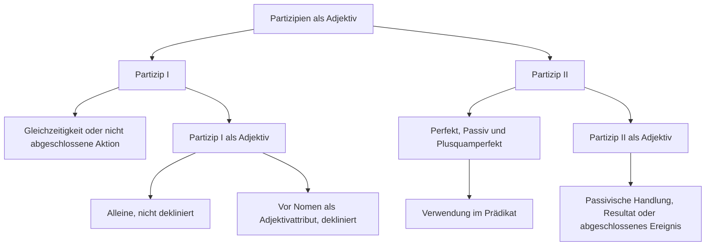

---
tags:
  - ready
  - grammatik
  - b2_2
  - deutsch
  - adjektiv
  - ready
---

# partizipien-als-adjektiv

## Partizip I

Das Partizip I als Adjektiv
drückt eine **Gleichzeitigkeit** oder eine nicht **abgeschlossene Aktion** aus. Gleichzeitigkeit bedeutet, dass zeitgleich zwei parallele Handlungen durchgeführt werden. Eine von beiden Handlungen wird untergeordnet und bildet das **Partizip I**, die andere Handlung ist übergeordnet und bildet das Prädikat im Satz.

Beispiele:

- Der Hund liegt vor seiner Hundehütte und **knurrt**.
- Der Hund liegt **knurrend** vor seiner Hundehütte.

- Der Chef ging aus dem Zimmer und **lachte**.
- Der Chef ging **lachend** aus dem Zimmer.

Das **Partizip I** kann **alleine** stehen. In diesem Fall wird es **nicht dekliniert**.

- Die Hausfrau kocht Suppe und **telefoniert** dabei.
- Die **telefonierende** Hausfrau kocht Suppe.

- Der Vogel saß auf einem Ast. Dabei **zwitscherte** er.
- Der **zwitschernde** Vogel saß auf einem Ast.

Steht das **Partizip I** vor dem Nomen als Adjektivattribut, gelten die allgemeinen Regeln zur Adjektivdeklination.

`Artikel + Partizip I + Adjektivdeklination + Nomen`

**Wie kann man das Partizip I bilden?**

- Das Partizip I bildet man mit dem Infinitiv + d: schreiend, schwimmend, wartend, ...

## Partizip II

Das **Partizip II** wird gebraucht, um das Perfekt, das Passiv und das Plusquamperfekt zu bilden. In diesen Fällen ist das **Partizip II** Teil des Prädikats. Beide Partizipien, sowohl Partizip I als auch Partizip II, können auch wie ein Adjektiv benutzt werden.

**Wie kann man das Partizip II nutzen?**

- Verb + Partizip II (als Teil des Prädikats): Das Geschäft bleibt heute wegen Krankheit geschlossen.Das Fenster ist geöffnet.Das Haus ist komplett abgebrannt.
- Partizip II + Nomen (Adjektivfunktion): Das schwer verletzte Tier ist nach drei Tagen verstorben.Der abgetrennte Finger konnte wieder angenäht werden.Der verstorbene Mann hinterließ ein Millionenerbe.

**Wie kann man das Partizip II bilden?**

- Das Partizip II der regelmäßigen Verben bildet man nach den bekannten Regeln.
- Das Partizip II der unregelmäßigen Verben bildet man nach den bekannten Regeln.

Das Partizip II als Adjektiv drückt meist eine **passivische Handlung**, **ein Resultat** oder **etwas Abgeschlossenes** aus. Die beiden Handlungen laufen **nicht parallel**, sondern **zeitlich** versetzt.

- Der Dieb fand den Schmuck nicht. Der Schmuck wurde **versteckt**.
- Der Dieb fand den **versteckten** Schmuck nicht.

- Herr Klatsch hat sich ein Auto gekauft. Sein neues Auto ist aber **gebraucht**.
- Herr Klatsch hat sich ein **gebrauchtes** Auto gekauft.

- Letzte Woche wurde mir mein Fahrrad **gestohlen**. Gestern wurde es wiedergefunden.
- Gestern wurde mein **gestohlenes** Fahrrad wiedergefunden.

Das Partizip II als Attribut steht zwischen dem Artikel und dem Nomen, auf das es sich bezieht (der ... Schmuck, das ... Auto, das ... Fahrrad). Steht das Partizip II vor dem Nomen als Adjektivattribut, gelten die allgemeinen Regeln zur Adjektivdeklination.

`Artikel + Partizip II + Adjektivdeklination + Nomen`

