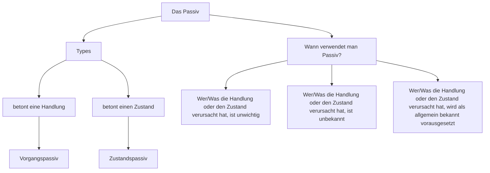

---
tags:
  - language
  - grammatik
  - deutsch
  - reviewed
  - passive
  - ready
---


Hier ist das vervollständigte Template für das Thema „Passiv auf Deutsch“:

```markdown
# Passiv auf Deutsch

## Erklärung

Das Passiv ist eine grammatische Form, die verwendet wird, um die Handlung oder den Zustand eines Satzes hervorzuheben, anstatt die Person oder Sache, die die Handlung ausführt. Im Passiv liegt der Fokus auf dem Geschehen oder dem Zustand selbst und nicht auf dem Handelnden. Es gibt zwei Hauptarten des Passivs im Deutschen:

- **Vorgangspassiv**: Betont den Verlauf einer Handlung. Es wird mit den Hilfsverben „werden“ und dem Partizip II gebildet.
- **Zustandspassiv**: Betont den Zustand nach einer Handlung. Es wird mit dem Hilfsverb „sein“ und dem Partizip II gebildet.

## Beispiele

- **Vorgangspassiv**:
  - „Das Buch wird gelesen.“ (Die Handlung des Lesens wird betont.)
  - „Der Brief wurde geschrieben.“ (Die Handlung des Schreibens wird betont.)

- **Zustandspassiv**:
  - „Das Buch ist gelesen.“ (Der Zustand des Buches nach dem Lesen wird betont.)
  - „Der Brief ist geschrieben.“ (Der Zustand des Briefes nach dem Schreiben wird betont.)

## Links

- <https://deutsch.lingolia.com/de/grammatik/verben/passiv>


