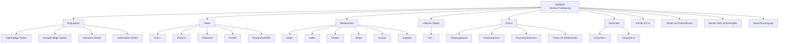

# B11: Grammatik Verben

```mermaid
flowchart TD
    A[VERBEN DeutschTraining.org]

    A --> B[Konjugation]
    B --> B1[regelmäßige Verben]
    B --> B2[unregelmäßige Verben]
    B --> B3[trennbare Verben]
    B --> B4[untrennbare Verben]

    A --> C[Zeiten]
    C --> C1[Futur I]
    C --> C2[Präsens]
    C --> C3[Präteritum]
    C --> C4[Perfekt]
    C --> C5[Plusquamperfekt]

    A --> D[Modalverben]
    D --> D1[wollen]
    D --> D2[sollen]
    D --> D3[können]
    D --> D4[dürfen]
    D --> D5[müssen]
    D --> D6[subjektiv]

    A --> E[reflexive Verben]
    E --> E1[sich ...]

    A --> F[Passiv]
    F --> F1[Vorgangspassiv]
    F --> F2[Zustandspassiv]
    F --> F3[Passiversatzformen]
    F --> F4[Passiv mit Modalverben]

    A --> G[Konjunktiv]
    G --> G1[Konjunktiv I]
    G --> G2[Konjunktiv II]

    A --> H[Infinitiv mit zu]

    A --> I[Verben mit Präpositionen]

    A --> J[Nomen-Verb-Verbindungen]

    A --> K[deutschtraining.org]

```