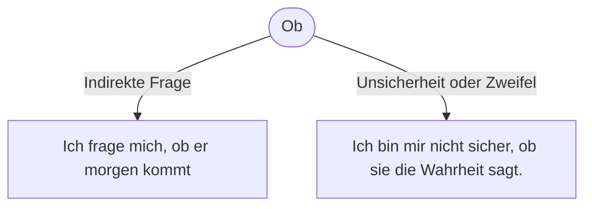

---
tags:
  - grammatik
  - deutsch
  - conditionals
  - konnektoren
  - ready
---

# B1: Ob

- [[b22-satzart-fragen]]
- [[alt-indirekte-fragen]]

## Indirekte Fragesätze: ob

Satzfragen heißen auch Ja/Nein-Fragen, weil man auf diese Fragen mit „Ja“ oder „Nein“ antworten kann. Hier steht das konjugierte Verb an erster Stelle. Dann folgt das Subjekt.

Ein ob-Satz ist ein Nebensatz, der mit der Konjunktion ob eingeleitet wird. Mit ob-Sätzen kann man  indirekte Ja-/Nein-Fragen bilden. ob-Sätze sind Objektsätze, die das Objekt des Hauptsatzes bilden. In diesem Fall kann auch der Hauptsatz in der Regel nicht allein stehen. Wie du es von anderen Nebensätzen schon kennst, „wandert“ das konjugierte Verb der Satzfrage ans Ende des Nebensatzes.

- Ich möchte wissen, ob du mir hilfst.
- Ich habe dich gefragt, ob du mir eine Webseite erstellen kannst.

## Ausdrücken von Unsicherheit oder Zweifel

- Ich bin mir nicht sicher, ob sie die Wahrheit sagt.
- Es ist fraglich, ob er das schafft.

