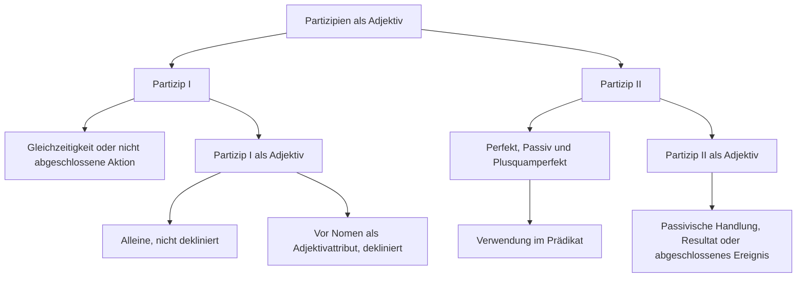

---
tags:
- ready
- online
- grammatik
- b2_2
- deutsch
- adjektiv
- ready
- online
---

# partizipien-als-adjektiv

## Partizip I

Das Partizip I als Adjektiv
drückt eine __Gleichzeitigkeit__ oder eine nicht __abgeschlossene Aktion__ aus. Gleichzeitigkeit bedeutet, dass zeitgleich zwei parallele Handlungen durchgeführt werden. Eine von beiden Handlungen wird untergeordnet und bildet das __Partizip I__, die andere Handlung ist übergeordnet und bildet das Prädikat im Satz.

Beispiele:

- Der Hund liegt vor seiner Hundehütte und __knurrt__.
- Der Hund liegt __knurrend__ vor seiner Hundehütte.

- Der Chef ging aus dem Zimmer und __lachte__.
- Der Chef ging __lachend__ aus dem Zimmer.

Das __Partizip I__ kann __alleine__ stehen. In diesem Fall wird es __nicht dekliniert__.

- Die Hausfrau kocht Suppe und __telefoniert__ dabei.
- Die __telefonierende__ Hausfrau kocht Suppe.

- Der Vogel saß auf einem Ast. Dabei __zwitscherte__ er.
- Der __zwitschernde__ Vogel saß auf einem Ast.

Steht das __Partizip I__ vor dem Nomen als Adjektivattribut, gelten die allgemeinen Regeln zur Adjektivdeklination.

`Artikel + Partizip I + Adjektivdeklination + Nomen`

__Wie kann man das Partizip I bilden?__

- Das Partizip I bildet man mit dem Infinitiv + d: schreiend, schwimmend, wartend, ...

## Partizip II

Das __Partizip II__ wird gebraucht, um das Perfekt, das Passiv und das Plusquamperfekt zu bilden. In diesen Fällen ist das __Partizip II__ Teil des Prädikats. Beide Partizipien, sowohl Partizip I als auch Partizip II, können auch wie ein Adjektiv benutzt werden.

__Wie kann man das Partizip II nutzen?__

- Verb + Partizip II (als Teil des Prädikats): Das Geschäft bleibt heute wegen Krankheit geschlossen.Das Fenster ist geöffnet.Das Haus ist komplett abgebrannt.
- Partizip II + Nomen (Adjektivfunktion): Das schwer verletzte Tier ist nach drei Tagen verstorben.Der abgetrennte Finger konnte wieder angenäht werden.Der verstorbene Mann hinterließ ein Millionenerbe.

__Wie kann man das Partizip II bilden?__

- Das Partizip II der regelmäßigen Verben bildet man nach den bekannten Regeln.
- Das Partizip II der unregelmäßigen Verben bildet man nach den bekannten Regeln.

Das Partizip II als Adjektiv drückt meist eine __passivische Handlung__, __ein Resultat__ oder __etwas Abgeschlossenes__ aus. Die beiden Handlungen laufen __nicht parallel__, sondern __zeitlich__ versetzt.

- Der Dieb fand den Schmuck nicht. Der Schmuck wurde __versteckt__.
- Der Dieb fand den __versteckten__ Schmuck nicht.

- Herr Klatsch hat sich ein Auto gekauft. Sein neues Auto ist aber __gebraucht__.
- Herr Klatsch hat sich ein __gebrauchtes__ Auto gekauft.

- Letzte Woche wurde mir mein Fahrrad __gestohlen__. Gestern wurde es wiedergefunden.
- Gestern wurde mein __gestohlenes__ Fahrrad wiedergefunden.

Das Partizip II als Attribut steht zwischen dem Artikel und dem Nomen, auf das es sich bezieht (der ... Schmuck, das ... Auto, das ... Fahrrad). Steht das Partizip II vor dem Nomen als Adjektivattribut, gelten die allgemeinen Regeln zur Adjektivdeklination.

`Artikel + Partizip II + Adjektivdeklination + Nomen`

