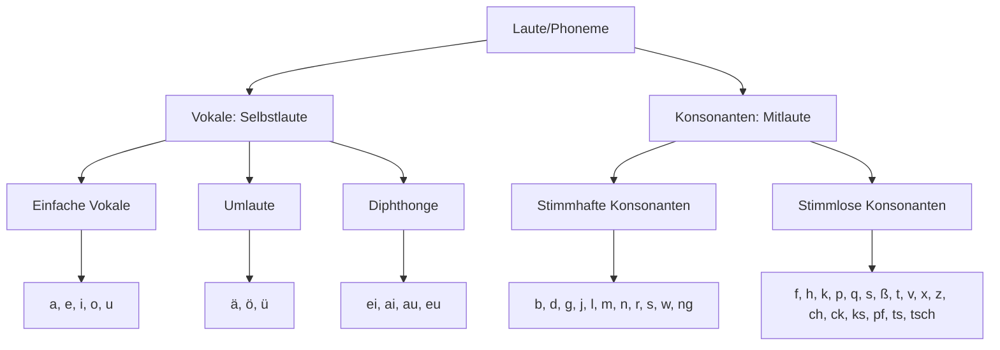
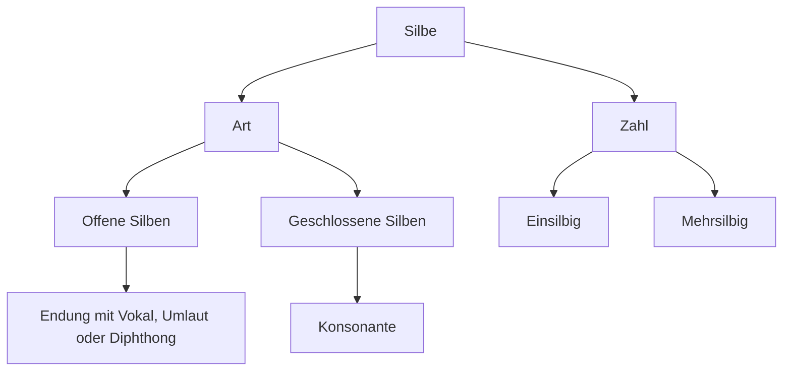

---
tags:
- deutsch
- ready
- online
- grammatik
- artikel
- artikelwörter
---

# Grammatik: Die Bausteine der Sprache

## Die Silbe

## Wortbausteine

Morpheme: bedeutungstragenden Wortbausteine
- mit inhaltlicher Bedeutung
- mit grammatischer Funktion

Sprechsilben != Sprachsilben

Lexeme: selbstständigen Wort

Wortstämme: Kern eines Wortes

Präfixe: Vorsilben
Suffixe: Endungen