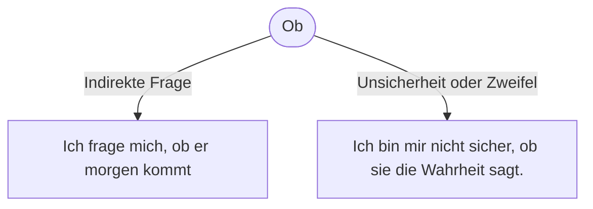

______________________________________________________________________

id: grammatik-satzarte-indirekte-fragen
aliases: [ ]
tags:
\- grammatik
\- deutsch
\- konnektoren
\- w-fragen
\- fragen
\- b11
\- --

```
# B1: Ob

- [ [ b22-satzart-fragen ] ]

  ## Indirekte Fragesätze: ob

  Satzfragen
  heiß
  en
  auch Ja/Nein-Fragen, weil man auf diese Fragen mit „Ja“ oder „Nein“ antworten kann. Hier steht das konjugierte Verb an erster Stelle. Dann folgt das Subjekt.
```

Ein ob-Satz ist ein Nebensatz, der mit der Konjunktion ob eingeleitet wird. Mit ob-Sätzen kann man indirekte Ja-/Nein-Fragen bilden. ob-Sätze sind Objektsätze, die das Objekt des Hauptsatzes bilden. In diesem Fall kann auch der Hauptsatz in der Regel nicht allein stehen. Wie du es von anderen Nebensätzen schon kennst, „wandert“ das konjugierte Verb der Satzfrage ans Ende des Nebensatzes.

- Ich möchte wissen, ob du mir hilfst.
- Ich habe dich gefragt, ob du mir eine Webseite erstellen kannst.

## Ausdrücken von Unsicherheit oder Zweifel

- Ich bin mir nicht sicher, ob sie die Wahrheit sagt.
- Es ist fraglich, ob er das schafft.



### W-Fragen

__Bei indirekten Fragen mit Fragewort wird der Nebensatz mit dem jeweiligen Fragewort eingeleitet.__

__Direkte Frage:__
Wer ist __mein Ansprechpartner?__

__Indirekte Frage:__
Ich möchte gern wissen, wer mein Ansprechpartner ist.

### Ja-/Nein-Fragen

__Bei indirekten Fragen ohne Fragewort wird der Nebensatz mit „ob“ eingeleitet.__

__Direkte Frage:__
Wird mein Studium anerkannt?

__Indirekte Frage:__
Können Sie mir sagen, ob mein Studium anerkannt wird?

### Beispiele

- __Welche Chancen habe ich in diesem Beruf?__
  Ich möchte mich erkundigen, welche Chancen ich in diesem Beruf habe.

- __Wo finde ich passende Stellenangebote?__
  Können Sie mir sagen, wo ich passende Stellenangebote finde?

- __Kann ich meinen Abschluss anerkennen lassen?__
  Ich möchte mich informieren, ob ich meinen Abschluss anerkennen lassen kann.

- __Bekomme ich finanzielle Unterstützung?__
  Können Sie mir sagen, ob ich finanzielle Unterstützung bekomme?

- __Bei welchen Firmen kann ich mich bewerben?__
  Ich möchte wissen, bei welchen Firmen ich mich bewerben kann.

- __Gibt es Alternativen dazu?__
  Ich möchte mich informieren, ob es Alternativen dazu gibt.

- __Was verdiene ich in diesem Beruf?__
  Können Sie mir sagen, was ich in diesem Beruf verdiene?

## Ref

\[[b22-satzart-fragen]\]
