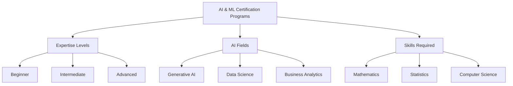

______________________________________________________________________

id: ai-engineer-introduction-what-is-an-ai-engineer
aliases: [ ]
tags:
\- roadmap
\- ai-engineer
\- ai-engineer-introduction
\- ready
\- --

```
# ai-engineer-introduction-what-is-an-ai-engineer

## Contents

__Roadmap info from [ roadmap website ] (https://roadmap.sh/ai-engineer/what-is-an-ai-engineer@GN6SnI7RXIeW8JeD-qORW) __

  ## What is an AI Engineer?

  AI
  engineers
  are
  professionals
  who
  specialize in designing, developing, and implementing artificial intelligence (AI) systems. Their work is essential in various industries, as they create applications that enable machines to perform tasks that typically require human intelligence, such as problem-solving, learning, and decision-making.
```

Visit the following resources to learn more:

- [@article@How to Become an AI Engineer: Duties, Skills, and Salary](https://www.simplilearn.com/tutorials/artificial-intelligence-tutorial/how-to-become-an-ai-engineer)



- [@article@AI engineers: What they do and how to become one](https://www.techtarget.com/whatis/feature/How-to-become-an-artificial-intelligence-engineer)
- [@course@AI For Everyone](https://www.coursera.org/learn/ai-for-everyone)
