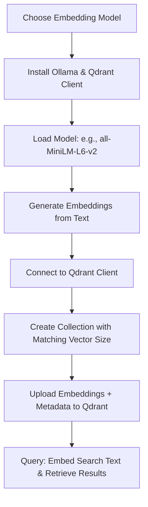

______________________________________________________________________

id: ai-engineer-ollama
aliases: [ ]
tags:
\- roadmap
\- output
\- ai-engineer
\- ready
\- --

```
# ai-engineer-ollama

## Contents

- [ [ ai-engineer-ollama-ollama-models ] ]
- [ [ ai-engineer-ollama-ollama-sdk ] ]

  __Roadmap
  info
  from [ roadmap website ]
  (https://roadmap.sh/ai-engineer/ollama@--ig0Ume_BnXb9K2U7HJN)
  __

  ### __Comparison Table of Embedding Models__

  |
  Model                |
  Use
  Cases                          |
  Minimum
  Hardware
  Requirements |
  Learning
  Curve |
| - ---------------------|------------------------------------|--------------------------------|----------------|
| __BERT-base__         | Text classification, NER, QA       | 8GB GPU VRAM                   | Moderate       |
```

| __all-MiniLM-L6-v2__ | Semantic search, clustering | 4GB GPU VRAM or CPU | Low |
| __RoBERTa-large__ | High-accuracy NLP tasks | 16GB GPU VRAM | High |
| __nomic-embed-text__ | Long-context retrieval, RAG | 8GB GPU VRAM | Moderate |
| __DistilBERT__ | Mobile apps, low-resource devices | 4GB CPU/GPU | Low |

______________________________________________________________________

### __Mermaid Flowchart: Using Embedding Models with Qdrant__


