# AI Study Case: Chat in own story contents


### Architecture Solutions for Building a RAG-Based Story Analysis Chat

Below is a comparison of different architectural approaches, their complexity, learning time, and pros/cons:

| **Architecture**               | **Complexity** | **Learning Time** | **Advantages**                                                                 | **Disadvantages**                                                                 |
|---------------------------------|----------------|-------------------|--------------------------------------------------------------------------------|-----------------------------------------------------------------------------------|
| **Basic RAG with Vector DB**    | Low            | 1-2 days          | Quick setup, minimal dependencies, Python-friendly.                           | Limited scalability, basic retrieval, no advanced NLP features.                   |
| **Advanced RAG (LangChain/LlamaIndex)** | Medium       | 3-7 days          | Modular workflows, multi-doc support, better prompt engineering.              | Requires learning LangChain/LlamaIndex APIs.                                      |
| **NLP-Enhanced RAG**            | Medium-High    | 1-2 weeks         | Adds entity recognition, summarization, and topic modeling.                   | Requires NLP expertise (e.g., spaCy, NLTK).                                      |
| **Cloud-Based RAG (AWS/GCP)**   | High           | 1-3 weeks         | Scalable, managed services, serverless options.                               | Costly for large datasets, vendor lock-in, cloud-specific learning.               |
| **Real-Time RAG with Streaming**| High           | 2-4 weeks         | Real-time updates (e.g., new story content).                                  | Complex setup (e.g., Kafka/Spark), overkill for static datasets.                  |

---

### Mermaid Architecture Diagrams

```mermaid
graph LR
    %% Basic RAG with Vector DB
    subgraph Basic RAG
        A[Story Documents] --> B[Vector Database<br> FAISS/Chroma]
        B --> C[Retriever]
        C --> D[LLM<br>e.g., GPT-3.5, Llama2]
        D --> E[Response]
    end

    %% Advanced RAG (LangChain)
    subgraph Advanced RAG
        F[Story Documents] --> G[Preprocessor]
        G --> H[Vector DB + Metadata]
        H --> I[LangChain<br>RetrievalQA]
        I --> J[Custom Prompts]
        J --> K[LLM]
        K --> L[Response]
    end

    %% NLP-Enhanced RAG
    subgraph NLP-Enhanced RAG
        M[Story Documents] --> N[spaCy NLP Pipeline]
        N --> O[Entities/Summaries]
        O --> P[Vector DB]
        P --> Q[Retriever + LLM]
        Q --> R[Enriched Response]
    end

    %% Cloud-Based RAG
    subgraph Cloud RAG
        S[Story Documents] --> T[Cloud Storage<br> S3/GCS]
        T --> U[Managed LLM<br>Bedrock/Vertex AI]
        U --> V[Lambda/Cloud Function]
        V --> W[API Response]
    end

    %% Real-Time RAG
    subgraph Real-Time RAG
        X[New Story Content] --> Y[Kafka/Spark Stream]
        Y --> Z[Real-Time Processing]
        Z --> AA[Update Vector DB]
        AA --> AB[LLM]
        AB --> AC[Live Response]
    end
```



---

### Tool Selection Guide (Python-Centric)

#### Core Components:
| **Component**          | **Tools**                                                                 |
|-------------------------|---------------------------------------------------------------------------|
| **Vector Database**     | FAISS (local), Chroma (local), Pinecone (cloud)                          |
| **LLM Integration**     | Hugging Face Transformers, OpenAI API, Llama.cpp (local LLMs)            |
| **RAG Framework**       | LangChain, LlamaIndex, Haystack                                           |
| **NLP Preprocessing**   | spaCy, NLTK, Gensim                                                      |
| **Cloud Services**      | AWS Bedrock, Google Vertex AI, Azure AI                                  |
| **Streaming**           | Apache Kafka (with `kafka-python`), RabbitMQ                              |
| **APIs/Deployment**     | FastAPI, Flask, Docker                                                   |

#### Recommended Stack for a Writer:
1. **Start Simple**:  
   - **Vector DB**: FAISS (easy Python integration).  
   - **LLM**: Hugging Face’s `flan-t5` or GPT-3.5-turbo.  
   - **Framework**: LangChain (simplifies RAG pipelines).  
   - **NLP**: spaCy for entity extraction.  

2. **Scale Up (if needed)**:  
   - Use **LlamaIndex** for document structuring or **Pinecone** for scalable vector search.  
   - Deploy with **FastAPI** + **Docker** for a web interface.  

3. **Python Libraries to Prioritize**:  
   ```python
   # Pip install example
   pip install langchain faiss-cpu transformers spacy sentence-transformers fastapi
   ```

