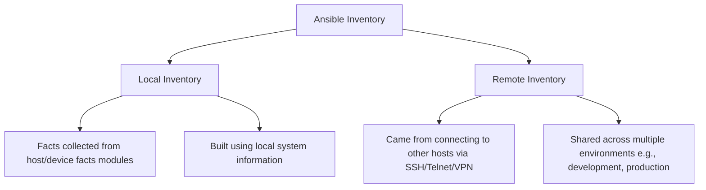
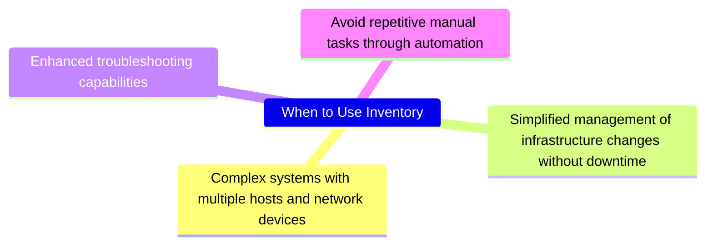

---
tags:
- roadmap
- devops
- devops-configuration-management
- ready
- online
- ansible
- configurations
---

# devops-configuration-management-ansible

## Contents

__Roadmap info from [roadmap website](https://roadmap.sh/devops/ansible@h9vVPOmdUSeEGVQQaSTH5)__

## Ansible

Ansible is an open-source automation tool used for configuration management, application deployment, and task automation. It simplifies the process of managing and orchestrating infrastructure by using a declarative language to define desired states and configurations. Ansible operates using YAML files, called playbooks, which describe the tasks to be executed on remote systems. It employs an agentless architecture, meaning it uses SSH or other remote protocols to execute tasks on target machines without requiring additional software to be installed. Ansible is widely used for automating repetitive tasks, ensuring consistency, and managing large-scale deployments across various environments.

Visit the following resources to learn more:

* [@official@Ansible Website](https://www.ansible.com/)
* [@course@Ansible Full Course for Beginners](https://www.youtube.com/watch?v=9Ua2b06oAr4)
* [@video@Ansible in 100 Seconds](https://www.youtube.com/watch?v=xRMPKQweySE)
* [@feed@Explore top posts about Ansible](https://app.daily.dev/tags/ansible?ref=roadmapsh)

## Examples

Here is an Ansible playbook that creates a virtual machine with Postgres installed:

```yaml
---
- name: Create a VM with Postgres
  hosts: localhost
  become: true

  tasks:
  - name: Install virt-install and libvirt
    package:
      name: virt-install, libvirt
      state: present
  - name: Create a virtual machine
    virt_install:
      name: myvm
      memory: 4096
      vcpus: 2
      disk: /path/to/vm/disk.img
      network: bridge=br0,model=virtio

  - name: Install Postgres
    package:
      name: postgresql-server
      state: present

  - name: Configure Postgres
    template:
      src: templates/postgresql.conf.j2
      dest: /etc/postgresql/13/main/postgresql.conf
      mode: '0644'
    notify: restart postgre
    handlers:
  - name: restart postgre
    service:
      name: postgresql
      state: restarted
```

Let me explain what this playbook does:

1. The first task installs the `virt-install` and `libvirt` packages, which are required to create a virtual machine.
2. The second task uses the `virt_install` module to create a new virtual machine with 4GB of RAM, 2 CPUs, and a disk image at `/path/to/vm/disk.img`. It also sets up a network bridge using the `virtio` model.
3. The third task installs the Postgres server package using the `package`
module.
4. The fourth task uses a template to configure the Postgres configuration file (`postgresql.conf`) and notifies the `restart postgre` handler to restart the Postgres service.

You'll need to create a `templates` directory with a `postgresql.conf.j2` template file that contains the desired Postgres configuration settings.

Here's an example `postgresql.conf.j2` template:

```jinja2
listen_addresses = '*'
port = 5432
max_connections = 100
```

This template sets up the Postgres listener to listen on all available network interfaces, sets the port to 5432, and limits the maximum number of connections to 100.

To use this playbook, save it as a YAML file (e.g., `create_vm_with_postgres.yml`) and then run it using Ansible:

```bash
ansible-playbook -i <path/to/inventory> create_vm_with_postgres.yml
```

Replace `<path/to/inventory>` with the path to your Ansible inventory file.

## Inventory



### When to Use Inventory


