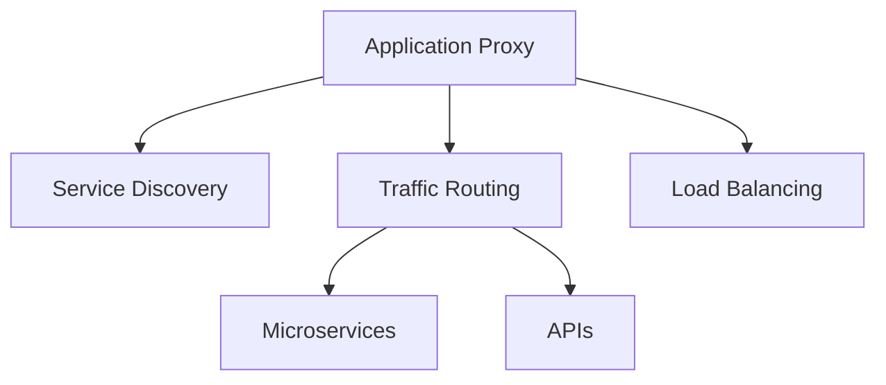

---
tags:
  - roadmap
  - devops
  - devops-what-is-and-how-to-setup-x
  - ready
  - online
---

# devops-what-is-and-how-to-setup-x-load-balancer

## Contents

__Roadmap info from [roadmap website](https://roadmap.sh/devops/load-balancer@i8Sd9maB_BeFurULrHXNq)__

## Load Balancer

Load Balancer acts as the __traffic cop__ sitting in front of your servers and routing client requests across all servers capable of fulfilling those requests in a manner that maximizes speed and capacity utilization and ensures that no one server is overworked. If one of the servers goes down, the load balancer redirects traffic to the remaining online servers.

Visit the following resources to learn more:

* [@article@What is Load Balancing?](https://www.nginx.com/resources/glossary/load-balancing/)
* [@article@Load Balancing concepts and algorithms](https://www.cloudflare.com/en-gb/learning/performance/what-is-load-balancing/)
* [@article@NGINX Reverse Proxy and Load Balancing](https://dzone.com/articles/nginx-reverse-proxy-and-load-balancing)
* [@video@What is a Load Balancer?](https://www.youtube.com/watch?v=sCR3SAVdyCc)

### __Self-Hosted Load Balancers__

* __Use case__: Best for organizations needing full control over their infrastructure, high customization, or working in environments with specific compliance needs (e.g., on-premise, private cloud). It requires skilled network and system administrators.

* __Strengths__: Flexibility, custom configurations, lower cost at small scale.
* __Examples__:
  * __HAProxy__: High-performance, open-source solution with robust features for load balancing and application security.
  * __Nginx__: Powerful web server and reverse proxy that supports load balancing.
  * __Traefik__: Ideal for microservices and container-based environments like Docker and Kubernetes.

### __Cloud-Based Load Balancers__

* __Use case__: Ideal for businesses that prefer managed services, need rapid scalability, or operate in highly dynamic environments where traffic fluctuates (e.g., e-commerce, SaaS). It's well-suited for teams without deep infrastructure management expertise.

* __Strengths__: Scalability, low management overhead, integrated security.
* __Examples__:
  * __AWS ELB__: Automatically distributes incoming traffic across multiple AWS resources like EC2, ECS, Lambda.
  * __Azure Load Balancer__: Balances traffic across virtual machines in Azure and integrates well with other Azure services.
  * __Google Cloud Load Balancer__: Offers global load balancing with support for both TCP/UDP and HTTP(S).

### __Key Takeaways__

* __Self-hosted solutions__ offer more __control, customization__, and potentially __lower cost__ for small setups, but require manual scaling and management.

* __Cloud-based solutions__ provide __automatic scaling, high availability, and security__, but can become expensive at scale and offer limited customization over algorithms and infrastructure control.

## Traefik

- Traefik Hub API Gateway
- Traefik Hub API Management

### References

- [Code](https://github.com/traefik/traefik)
- [Doc traefik-hub](https://doc.traefik.io/traefik-hub/)




- [ ] Configure in Kaos

https://doc.traefik.io/traefik/getting-started/quick-start-with-kubernetes/

https://doc.traefik.io/traefik/providers/kubernetes-crd/

```bash
# Install Traefik Resource Definitions:
kubectl apply -f https://raw.githubusercontent.com/traefik/traefik/v3.2/docs/content/reference/dynamic-configuration/kubernetes-crd-definition-v1.yml

# Install RBAC for Traefik:
kubectl apply -f https://raw.githubusercontent.com/traefik/traefik/v3.2/docs/content/reference/dynamic-configuration/kubernetes-crd-rbac.yml
```

https://k3d.io/v5.7.4/usage/exposing_services/#2-via-nodeport
https://doc.traefik.io/traefik/providers/kubernetes-ingress/
https://media.ccc.de/v/nixcon-2023-35290-nix-and-kubernetes-deployments-done-right#t=214