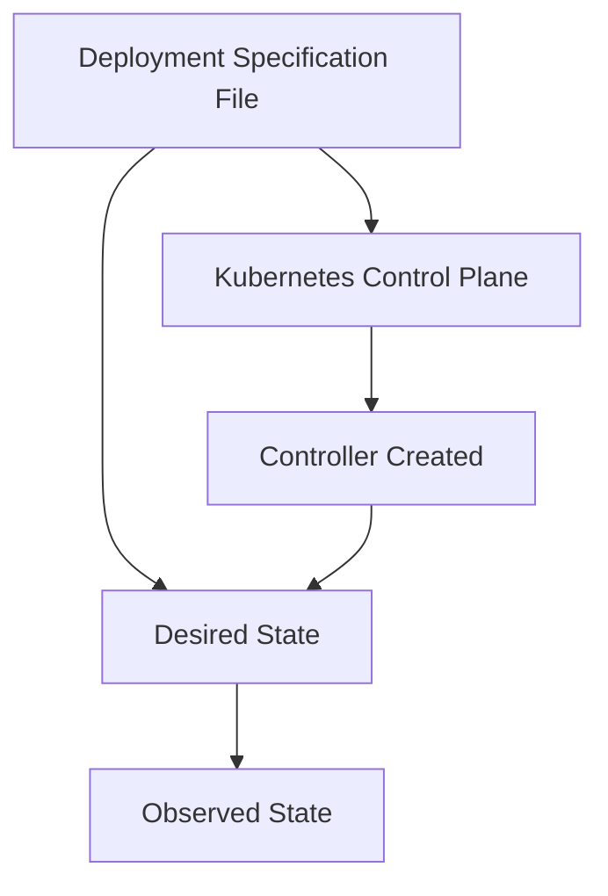

---
tags:
- roadmap
- kubernetes
- kubernetes-applications
- ready
- deployments
- strategies
- config
- online
---
# kubernetes-applications-deployments

## Contents

__Roadmap info from [roadmap website](https://roadmap.sh/kubernetes/running-applications/deployments)__

## Deployments

A Deployment is a resource object for __managing Pods__ and __ReplicaSets__ via a __declarative configuration__, which define a desired state that describes the application __workload__ life cycle, number of pods, deployment strategies, container images, and more. The Deployment Controller works to ensure the actual state matches desired state, such as by replacing a failed pod. Out of the box, Deployments support several __deployment strategies__, like “recreate” and “rolling update”, however can be customized to support more advanced deployment strategies such as _blue/green_ or _canary_ deployments.

Visit the following resources to learn more:

* [@official@Deployments Documentation](https://kubernetes.io/docs/concepts/workloads/controllers/deployment/)
* [@video@Kubernetes Deployments | Deployment Strategies](https://youtu.be/lxc4EXZOOvE)
* [@article@Kubernetes Deployment: From Basic Strategies to Progressive Delivery](https://codefresh.io/learn/kubernetes-deployment/)

|Deployment|StatefulSet|
|---|---|
|Intended for stateless applications|Intended for stateful applications|
|Pods are interchangeable|Pods are unique and have a persistent ID|
|All replicas share the same volumes and PersistentVolumeClaims|Each pod has its own volumes and PersistentVolumeClaims|

## Creating a deployment

__Key Terminology:__

1. __Pods__: The smallest deployable unit in Kubernetes, consisting of one or more containers that
share resources.
2. __Deployments__: A Kubernetes resource that describes the desired state of pods.
3. __Controllers__: Continuously running processes that monitor and maintain the desired state of
objects.

__Deployment Process:__

1. A deployment specification file (in YAML format) is submitted to the Kubernetes control plane.
2. The deployment controller creates a replica set, which instantiates and maintains a replica
version of the pods specified in the deployment.

__Deployment Object Details:__

1. API version
2. Kind (deployment)
3. Deployment name
4. Number of pod replicas
5. Pod template (metadata and specifications for each pod in the replica set)
6. Container image
7. Port to expose and accept traffic for the container

__Deployment Lifecycle States:__

1. __Processing__: The deployment is creating a new replica set or scaling up/down.
2. __Complete__: All new replicas are available and updated, with any old replicas not running.
3. __Failed__: The creation of a new replica set could not be completed (e.g., due to image surfacing issues or lack of permissions).

__Deployment Use Cases:__

1. Pod management tasks (updating, rolling back, scaling, auto-scaling)
2. Stateless applications (API servers, websites without dynamic content)

__Creating a Deployment:__

1. Using a YAML file with the `Kube CTL apply` command
2. Using the `Kube CTL create deployment` command (imperative method)
3. Creating a deployment through the Google Cloud Console

## Updating deployment

__Rolling Updates__

A rolling update, also known as a ramped strategy, allows you to update a deployment without anyone
noticing. When a deployment is updated, a new set of Pods are launched in a new replica set. Then
after the new Pods start running smoothly, the old Pods in the outdated replica set are gracefully
retired.

__Configuring Rolling Updates__

There are two primary parameters used to control the speed of rolling updates:

* __maxSurge__: specifies the maximum number of extra Pods that can be simultaneously running on the
new version.
* __maxUnavailable__: specifies the maximum number of Pods that can be unavailable at the same time.

To explain this further, let's work through an example of a rolling update:

__Example__

A deployment has a desired number of Pods set to 10 with the `maxUnavailable` parameter set to 10%
and the `maxSurge` parameter set to five. The old replica set has 10 Pods.

The deployment will begin by creating five new Pods in a new replica set based on the `maxSurge`
parameter.

When those new Pods are ready, the total number of Pods will change to 15. Since the `maxUnavailable`
parameter is set to 10%, the minimum number of Pods that can run, regardless of whether they are from
the old or new replica set, is 10 - 10%. This equals at least a minimum of nine Pods.

Therefore, six of the 15 Pods can be removed from the old replica set, leaving a minimum of nine,
five in the new replica set, and four in the old replica set. Next, an additional five Pods will be
launched on the new replica set, totaling 10 Pods in the new replica set and 14 in all replica sets.

Finally, the remaining four Pods in the old replica set will be deleted. The old replica set will be
retained for rollback, even though it's empty, and this will leave 10 Pods in the new replica set.

## Flashcard

stateless applications::A stateless application does not store data or state in a cluster or persistent storage and can be scaled up or down as needed without impacting the application's functionality.

maxSurge::MaxSurge specifies the maximum number of extra Pods that can be simultaneously running on the new version

MaxUnavailable::MaxUnavailable specifies the maximum number of Pods that can be unavailable at the same time.

Requests:: Requests determine the minimum amount of CPU and memory that a container will be allocated on a node

Limits::Limits can set the upper boundary of how much CPU and memory a container can use on a node
