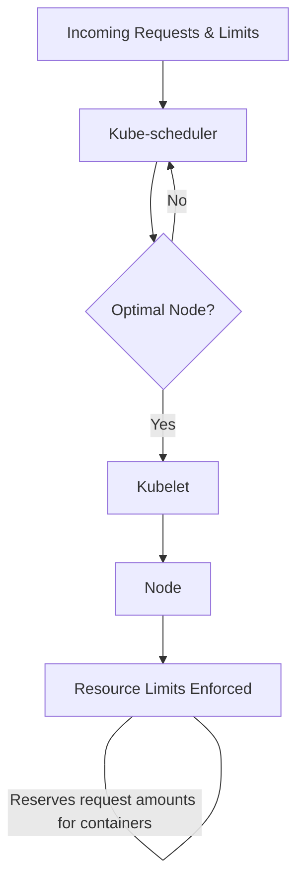

---
tags:
  - roadmap
  - kubernetes
  - kubernetes-management
  - ready
  - online
---

# kubernetes-management-setting-resource-requests-and-limits

## Contents

__Roadmap info from [roadmap website](https://roadmap.sh/kubernetes/resource-management/setting-resource-requests-and-limits)__

## Setting Resource Requests and Limits

Resource requests and limits in Kubernetes specify the minimum and maximum amount of CPU and memory a container requires to run. Resource requests are used for scheduling containers on nodes with sufficient resources, while limits enforce resource quotas and prevent containers from consuming too much. These settings can be configured at the pod or container level using the resources field in YAML. It’s important to set resource requests and limits correctly to ensure optimal resource utilization in your Kubernetes cluster.

Learn more from the following resources:

* [@official@Requests and limits - Documentation](https://kubernetes.io/docs/concepts/configuration/manage-resources-containers/#requests-and-limits)
* [@official@Motivation for default memory limits and requests](https://kubernetes.io/docs/tasks/administer-cluster/manage-resources/memory-default-namespace/#motivation-for-default-memory-limits-and-requests)
* [@article@Understanding Kubernetes Resource Types](https://thenewstack.io/understanding-kubernetes-resource-types/)
* [@article@Kubernetes Requests and Limits Demystified](https://thenewstack.io/kubernetes-requests-and-limits-demystified/)

__Managing Requests and Limits__

Cluster resources like CPU and memory change as rolling updates occur. To control these resources:

* __requests__: determine the minimum amount of CPU and memory that a container will be allocated on
a node.
* __limits__: set the upper boundary of how much CPU and memory a container can use on a node.

Requests cannot be lower than limits, and both must be specified for each individual container in the
Pod. Pods are scheduled as a group, so you still need to calculate the total resource requests and
limits by adding up the values from each individual container within the Pod.

__Kube-Scheduler__

Kubernetes uses the Kube-scheduler to decide which node to place the Pod on. If the optimal node
cannot be found for the request, it is sent back to the Kube-scheduler to try again. Once the optimal
node is found, the kubelet is used to enforce resource limits and ensure that the running container
is not allowed to use more of that resource than the limit set.

__Kube-Let__

The kubelet is also responsible for reserving request amounts for containers.

__CPU Resources__

CPU resources are measured in millicores. A container that needs two full cores to run would be
measured as 2,000m, millicores. A container that needs one quarter of a core would be measured as
250m.

## Flashcard

Requests:: Requests determine the minimum amount of CPU and memory that a container will be allocated on a node

Limits::Limits can set the upper boundary of how much CPU and memory a container can use on a node
