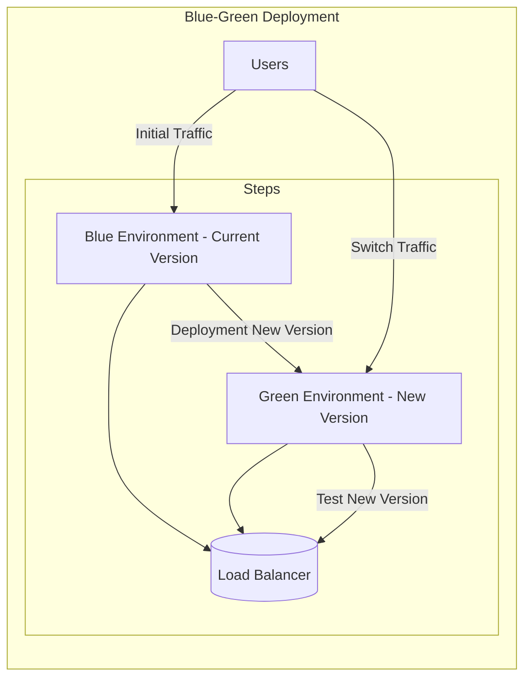

---
tags:
- roadmap
- kubernetes
- kubernetes-patterns
- ready
- online
- blue-green
- strategies
---

# kubernetes-patterns-blue-green-deployments

## Contents

__Roadmap info from [roadmap website](https://roadmap.sh/kubernetes/deployment-patterns/blue-green-deployments)__

## Blue Green Deployments

It is a deployment strategy used in Kubernetes for deploying new versions of an application by running two identical production environments, one with the current version (blue) and the other with the new version (green). After the green environment is fully tested, traffic is routed from the blue environment to the green environment, providing a seamless transition for users and avoiding any downtime or disruption. In Kubernetes, Blue-Green Deployments can be implemented using a variety of tools and techniques, including deployment strategies, traffic routing, and load balancing.

## Resources

* [@article@Create a Kubernetes Blue Green Deployment](https://developer.harness.io/docs/continuous-delivery/cd-execution/kubernetes-executions/create-a-kubernetes-blue-green-deployment/)
* [@video@Kubernetes - Blue/Green Deployments](https://www.youtube.com/watch?v=jxhpTGQ484Y)

### Blue-Green Deployment strategy

### Key Elements

1. __Users__: Initially directed to the blue environment (current version).
2. __Blue Environment__: Running the current version of the application.
3. __Green Environment__: Holds the new version and is tested thoroughly before switching traffic.
4. __Load Balancer__: Handles the transition from the blue environment to the green environment.

This approach ensures that no downtime occurs during deployment as traffic is seamlessly routed from the blue to the green environment after successful testing.
