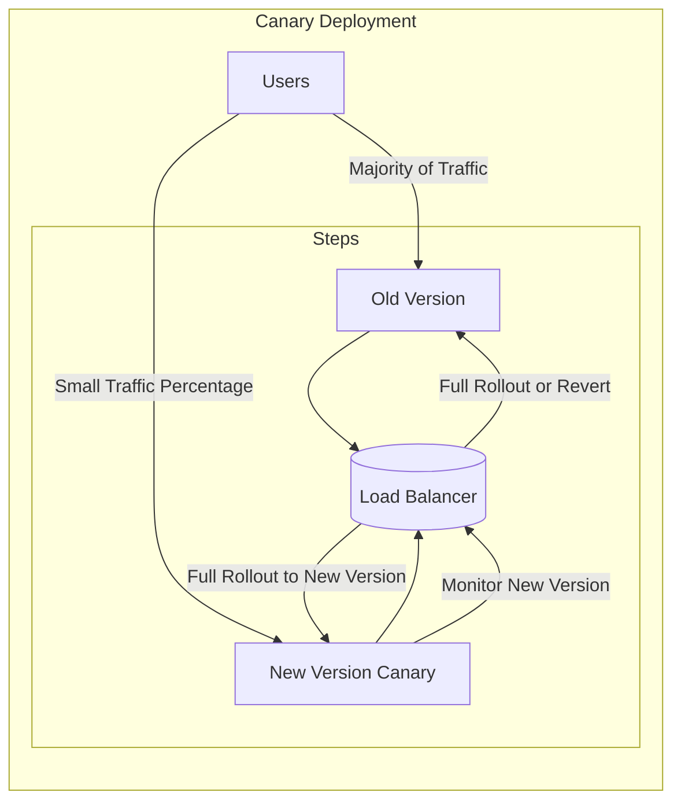

---
tags:
- roadmap
- kubernetes
- kubernetes-patterns
- ready
- online
---

# kubernetes-patterns-canary-deployments

## Contents

__Roadmap info from [roadmap website](https://roadmap.sh/kubernetes/deployment-patterns/canary-deployments)__

## Canary Deployments

Canary Deployments is a technique used in Kubernetes to gradually roll out new versions of an application by directing a small percentage of users or traffic to the new version while the majority continue using the old version. This approach allows for testing the new version under real-world conditions before fully committing to the update. In Kubernetes, canary deployments can be implemented using tools such as Istio, Linkerd, or Nginx, or by using built-in features like deployment strategies and traffic routing.

## Resources

* [@article@Canary deployment for K8s deployments](https://learn.microsoft.com/en-us/azure/devops/pipelines/ecosystems/kubernetes/canary-demo?view=azure-devops&tabs=yaml)
* [@video@Kubernetes canary deployments Explained](https://www.youtube.com/watch?v=sCevTD_GtvU)

### Canary Deployments

### Key Elements

1. __Users__: Majority of users are still directed to the old version, while a small percentage of traffic is routed to the canary (new) version.
2. __Old Version__: The current production version receiving the bulk of traffic.
3. __New Version (Canary)__: Receives a small portion of traffic to validate the new deployment under real-world conditions.
4. __Load Balancer__: Balances the traffic between old and canary versions.
5. __Monitoring__: Based on the performance of the canary, either a full rollout to the new version or a rollback to the old version occurs.

This method ensures a gradual rollout and limits the impact of potential issues with the new version.
