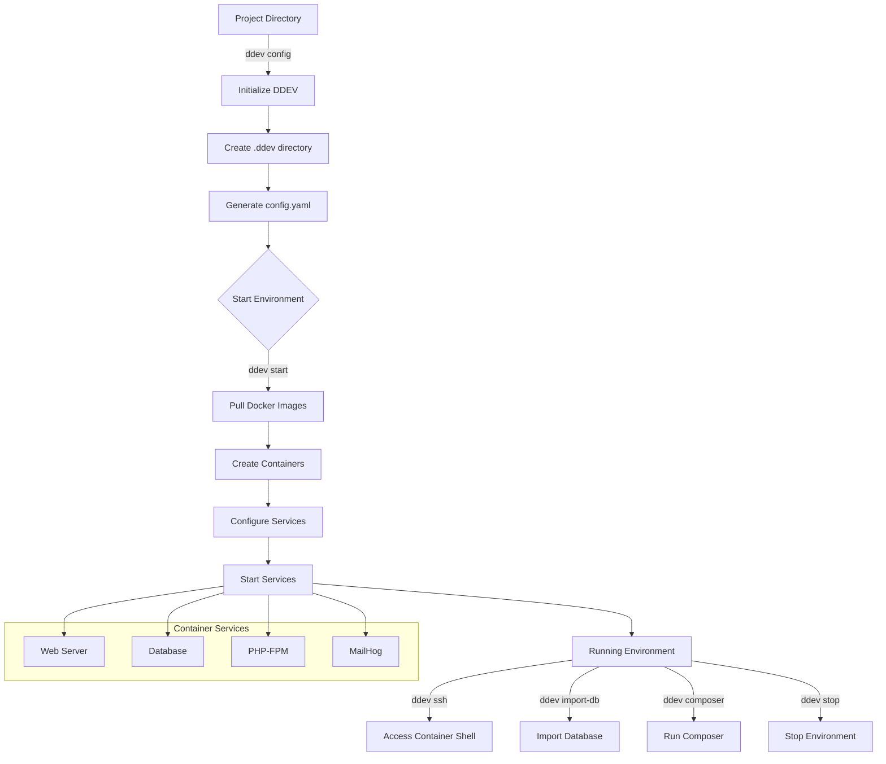

---
tags:
  - informatic
  - php
  - ddev    
---

# DDev

DDEV is an open source tool for launching local web development environments in minutes. It supports PHP and Node.js.

## Contents

- [Documetation](https://ddev.readthedocs.io/en/stable/)

I'll help you understand DDEV, which is a powerful open-source local development environment tool. Let me break this down into clear parts.

DDEV (Docker Development Environment) is a container-based local development environment tool that simplifies the process of setting up and managing development environments across different platforms. It uses Docker under the hood but abstracts away much of the complexity.

Here's a detailed table of DDEV's main characteristics:

| Characteristic | Description | Use Case |
|----------------|-------------|-----------|
| Container-Based Architecture | Uses Docker containers to create isolated development environments with all necessary dependencies | When you need to ensure development environment consistency across team members or prevent conflicts between different projects |
| Cross-Platform Compatibility | Works seamlessly on Windows, macOS, and Linux operating systems | Development teams using different operating systems but needing identical development environments |
| Project Configuration | Uses simple YAML files (`.ddev/config.yaml`) to define project settings and requirements | When you need to version control your development environment settings or share configurations across team members |
| Multiple Web Server Support | Supports Apache and Nginx web servers with easy switching between them | When different projects require different web server configurations or when testing compatibility |
| Database Management | Integrated support for MySQL, MariaDB, and PostgreSQL with automatic database configuration | Projects requiring different database versions or types without conflicting with local installations |
| Mail Catching | Includes MailHog for email testing and development | When developing and testing email functionality without sending real emails |
| Built-in SSL/TLS Support | Automatic SSL certificate generation for local development | Testing secure connections and developing features that require HTTPS |
| Xdebug Integration | Pre-configured PHP debugging capability | Debugging PHP applications with IDEs like PhpStorm or VS Code |
| Custom Commands | Allows creation of project-specific commands via hooks and custom scripts | Automating repetitive development tasks or creating project-specific workflows |
| Snapshot System | Built-in database and files backup/restore functionality | Quick restoration of development environments or sharing database states with team members |

This diagram shows the main workflow of DDEV, from project initialization to running various services. Let me explain the key steps:

1. The process begins in your project directory where you initialize DDEV using `ddev config`
2. DDEV creates a `.ddev` directory and generates the configuration files
3. When you start the environment (`ddev start`), DDEV:
   - Downloads necessary Docker images
   - Creates containers for each service
   - Configures the services based on your settings
   - Starts all services in the correct order

The running environment then provides several key services (web server, database, PHP-FPM, and MailHog) and allows you to interact with them through various commands like `ddev ssh` for shell access or `ddev import-db` for database operations.

Would you like me to explain any specific aspect of DDEV in more detail? I can dive deeper into topics like custom configurations, database management, or how to set up specific development environments for different frameworks.