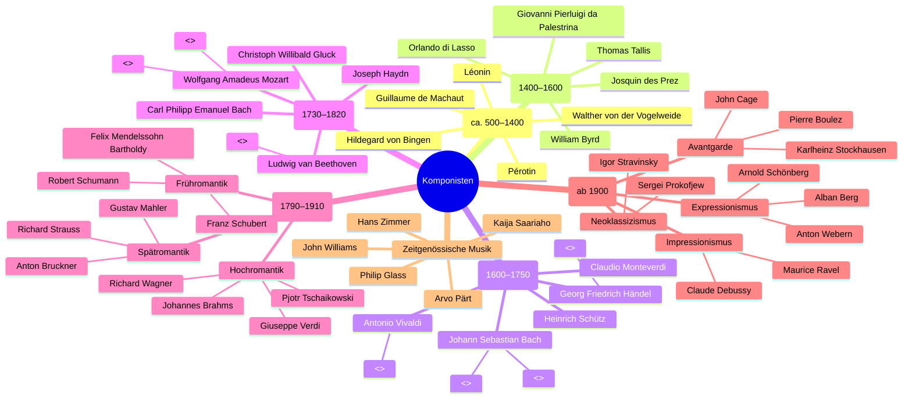

# General Music

- [ ] <https://github.com/HackerPoet/FractalSoundExplorer>

```mermaid
mindmap
  root((Komponisten))
    Mittelalter (ca. 500–1400)
      Hildegard von Bingen
      Walther von der Vogelweide
      Léonin
      Pérotin
      Guillaume de Machaut
    Renaissance (1400–1600)
      Josquin des Prez
      Giovanni Pierluigi da Palestrina
      Orlando di Lasso
      Thomas Tallis
      William Byrd
    Barock (1600–1750)
      Johann Sebastian Bach
        <<Brandenburgische Konzerte>>
        <<Matthäus-Passion>>
      Georg Friedrich Händel
        <<Messias>>
      Antonio Vivaldi
        <<Die vier Jahreszeiten>>
      Claudio Monteverdi
      Heinrich Schütz
    Klassik (1730–1820)
      Joseph Haydn
      Wolfgang Amadeus Mozart
        <<Requiem>>
        <<Die Zauberflöte>>
      Ludwig van Beethoven
        <<Symphonie Nr. 9>>
      Christoph Willibald Gluck
      Carl Philipp Emanuel Bach
    Romantik (1790–1910)
      Frühromantik
        Franz Schubert
        Robert Schumann
        Felix Mendelssohn Bartholdy
      Hochromantik
        Johannes Brahms
        Richard Wagner
        Giuseppe Verdi
        Pjotr Tschaikowski
      Spätromantik
        Gustav Mahler
        Richard Strauss
        Anton Bruckner
    Moderne (ab 1900)
      Impressionismus
        Claude Debussy
        Maurice Ravel
      Expressionismus
        Arnold Schönberg
        Alban Berg
        Anton Webern
      Neoklassizismus
        Igor Stravinsky
        Sergei Prokofjew
      Avantgarde
        Karlheinz Stockhausen
        John Cage
        Pierre Boulez
    Zeitgenössische Musik
      Arvo Pärt
      Hans Zimmer
      John Williams
      Philip Glass
      Kaija Saariaho
```
