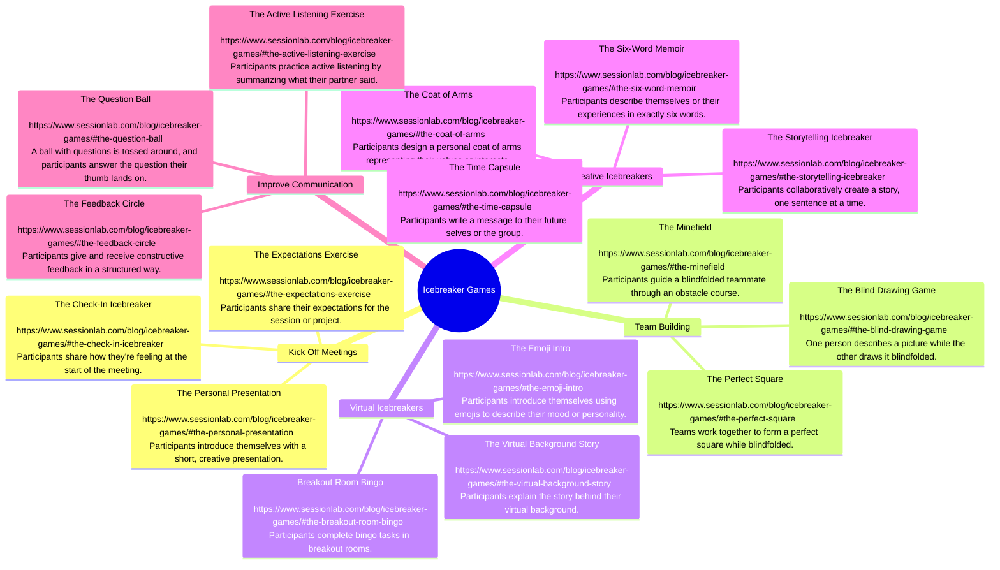

# Teaching: Icebreaker in Class

## **Icebreaker Games Summary**

| **Category**              | **Technique**                 | **Time**   | **Participants** | **Difficulty** | **Materials**                | **Description**                                                                                    | **Link**                                                                                |
| ------------------------- | ----------------------------- | ---------- | ---------------- | -------------- | ---------------------------- | -------------------------------------------------------------------------------------------------- | --------------------------------------------------------------------------------------- |
| **Quick Icebreakers**     | Two Truths and a Lie          | 5-10 mins  | 2-20+            | Easy           | None                         | Participants share two truths and one lie about themselves. Others guess which is the lie.         | [Link](https://www.sessionlab.com/blog/icebreaker-games/#two-truths-and-a-lie)          |
|                           | The Marshmallow Challenge     | 20-30 mins | 3-5 per team     | Medium         | Spaghetti, tape, marshmallow | Teams build the tallest structure using spaghetti, tape, and a marshmallow.                        | [Link](https://www.sessionlab.com/blog/icebreaker-games/#the-marshmallow-challenge)     |
|                           | The Memory Wall               | 10-15 mins | 5-20+            | Easy           | Sticky notes, pens           | Participants share a memory related to a theme, creating a "wall" of shared experiences.           | [Link](https://www.sessionlab.com/blog/icebreaker-games/#the-memory-wall)               |
|                           | The One-Word Icebreaker       | 5 mins     | 2-20+            | Easy           | None                         | Participants describe their current mood or expectations in one word.                              | [Link](https://www.sessionlab.com/blog/icebreaker-games/#the-one-word-icebreaker)       |
| **Funny Icebreakers**     | Would You Rather              | 10-15 mins | 2-20+            | Easy           | None                         | Participants choose between two funny or challenging options.                                      | [Link](https://www.sessionlab.com/blog/icebreaker-games/#would-you-rather)              |
|                           | The Human Knot                | 15-20 mins | 6-20             | Medium         | None                         | Participants stand in a circle, grab hands with two others, and untangle the "knot."               | [Link](https://www.sessionlab.com/blog/icebreaker-games/#the-human-knot)                |
|                           | The Name Game                 | 10 mins    | 5-20+            | Easy           | None                         | Participants say their name and an adjective that starts with the same letter.                     | [Link](https://www.sessionlab.com/blog/icebreaker-games/#the-name-game)                 |
| **Small Groups**          | The Paper Airplane Exercise   | 10-15 mins | 5-20             | Easy           | Paper, pens                  | Participants write a fun fact, make a paper airplane, and throw it to share.                       | [Link](https://www.sessionlab.com/blog/icebreaker-games/#the-paper-airplane-exercise)   |
|                           | The Common Ground Challenge   | 15-20 mins | 4-6 per group    | Easy           | None                         | Small groups find shared interests or experiences within the team.                                 | [Link](https://www.sessionlab.com/blog/icebreaker-games/#the-common-ground-challenge)   |
|                           | The Survival Game             | 20-30 mins | 4-6 per group    | Medium         | List of survival items       | Teams prioritize items needed to survive a hypothetical scenario.                                  | [Link](https://www.sessionlab.com/blog/icebreaker-games/#the-survival-game)             |
| **Large Groups**          | The Great Wind Blows          | 10-15 mins | 10-50+           | Easy           | Chairs                       | Participants switch seats based on shared characteristics or experiences.                          | [Link](https://www.sessionlab.com/blog/icebreaker-games/#the-great-wind-blows)          |
|                           | The Line Up Game              | 10-15 mins | 10-50+           | Easy           | None                         | Participants line up in order based on a specific criterion (e.g., birthday month).                | [Link](https://www.sessionlab.com/blog/icebreaker-games/#the-line-up-game)              |
|                           | The Bingo Icebreaker          | 15-20 mins | 10-50+           | Easy           | Bingo cards, pens            | Participants mingle to find people who match the descriptions on their bingo card.                 | [Link](https://www.sessionlab.com/blog/icebreaker-games/#the-bingo-icebreaker)          |
| **Kick Off Meetings**     | The Expectations Exercise     | 10-15 mins | 5-20+            | Easy           | Sticky notes, pens           | Participants share their expectations for the session or project.                                  | [Link](https://www.sessionlab.com/blog/icebreaker-games/#the-expectations-exercise)     |
|                           | The Check-In Icebreaker       | 5-10 mins  | 5-20+            | Easy           | None                         | Participants share how they’re feeling at the start of the meeting.                                | [Link](https://www.sessionlab.com/blog/icebreaker-games/#the-check-in-icebreaker)       |
|                           | The Personal Presentation     | 10-15 mins | 5-20+            | Medium         | Slides or props (optional)   | Participants introduce themselves with a short, creative presentation.                             | [Link](https://www.sessionlab.com/blog/icebreaker-games/#the-personal-presentation)     |
| **Team Building**         | The Blind Drawing Game        | 15-20 mins | 2 per pair       | Medium         | Paper, pens, blindfolds      | One person describes a picture while the other draws it blindfolded.                               | [Link](https://www.sessionlab.com/blog/icebreaker-games/#the-blind-drawing-game)        |
|                           | The Perfect Square            | 15-20 mins | 4-6 per group    | Medium         | Rope, blindfolds             | Teams work together to form a perfect square while blindfolded.                                    | [Link](https://www.sessionlab.com/blog/icebreaker-games/#the-perfect-square)            |
|                           | The Minefield                 | 20-30 mins | 4-6 per group    | Medium         | Obstacles, blindfolds        | Participants guide a blindfolded teammate through an obstacle course.                              | [Link](https://www.sessionlab.com/blog/icebreaker-games/#the-minefield)                 |
| **Virtual Icebreakers**   | The Emoji Intro               | 5-10 mins  | 5-20+            | Easy           | Emojis (digital)             | Participants introduce themselves using emojis to describe their mood or personality.              | [Link](https://www.sessionlab.com/blog/icebreaker-games/#the-emoji-intro)               |
|                           | The Virtual Background Story  | 10-15 mins | 5-20+            | Easy           | Virtual backgrounds          | Participants explain the story behind their virtual background.                                    | [Link](https://www.sessionlab.com/blog/icebreaker-games/#the-virtual-background-story)  |
|                           | Breakout Room Bingo           | 15-20 mins | 10-50+           | Easy           | Bingo cards (digital)        | Participants complete bingo tasks in breakout rooms.                                               | [Link](https://www.sessionlab.com/blog/icebreaker-games/#the-breakout-room-bingo)       |
| **Creative Icebreakers**  | The Storytelling Icebreaker   | 10-15 mins | 5-20+            | Easy           | None                         | Participants collaboratively create a story, one sentence at a time.                               | [Link](https://www.sessionlab.com/blog/icebreaker-games/#the-storytelling-icebreaker)   |
|                           | The Coat of Arms              | 20-30 mins | 5-20+            | Medium         | Paper, pens, markers         | Participants design a personal coat of arms representing their values or interests.                | [Link](https://www.sessionlab.com/blog/icebreaker-games/#the-coat-of-arms)              |
|                           | The Time Capsule              | 10-15 mins | 5-20+            | Easy           | Paper, pens                  | Participants write a message to their future selves or the group.                                  | [Link](https://www.sessionlab.com/blog/icebreaker-games/#the-time-capsule)              |
|                           | The Six-Word Memoir           | 10-15 mins | 5-20+            | Easy           | Paper, pens                  | Participants describe themselves or their experiences in exactly six words.                        | [Link](https://www.sessionlab.com/blog/icebreaker-games/#the-six-word-memoir)           |
| **Improve Communication** | The Active Listening Exercise | 15-20 mins | 2 per pair       | Medium         | None                         | Participants practice active listening by summarizing what their partner said.                     | [Link](https://www.sessionlab.com/blog/icebreaker-games/#the-active-listening-exercise) |
|                           | The Feedback Circle           | 20-30 mins | 5-20+            | Medium         | None                         | Participants give and receive constructive feedback in a structured way.                           | [Link](https://www.sessionlab.com/blog/icebreaker-games/#the-feedback-circle)           |
|                           | The Question Ball             | 10-15 mins | 5-20+            | Easy           | Ball with questions          | A ball with questions is tossed around, and participants answer the question their thumb lands on. | [Link](https://www.sessionlab.com/blog/icebreaker-games/#the-question-ball)             |

### Icebreaker Games Mindmap

